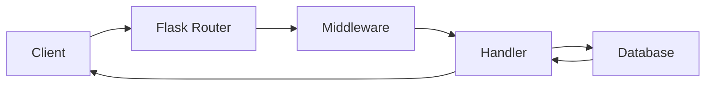

# How the App Starts

## Step 1: Entry Point

The application begins in `main.py`. The `main()` function is the CLI entry point:

```python
def main():
    app = create_app()
    app.run(host="0.0.0.0", port=8080)
```

## Step 2: App Factory

`create_app()` in `app.py` sets up Flask with all routes and middleware:

```python
def create_app():
    app = Flask(__name__)
    app.config.from_object(Config)
    register_routes(app)
    return app
```

## Step 3: Request Flow

Here's how a request flows through the system:



## Step 4: Route Registration

Routes are registered from a list of blueprints:

```python
def register_routes(app):
    for blueprint in BLUEPRINTS:
        app.register_blueprint(blueprint)
```

> **Note:** Each blueprint owns its own URL prefix and templates.

## Step 5: Configuration

The config is loaded from environment variables with sensible defaults:

```python
class Config:
    DEBUG = os.environ.get("DEBUG", False)
    SECRET_KEY = os.environ.get("SECRET_KEY", "dev-key")
    DATABASE_URL = os.environ.get("DATABASE_URL", "sqlite:///app.db")
```

## Summary

| Component | File | Purpose |
|-----------|------|---------|
| Entry point | `main.py` | CLI and server startup |
| App factory | `app.py` | Flask configuration |
| Routes | `routes/` | Request handlers |
| Config | `config.py` | Environment-based settings |
